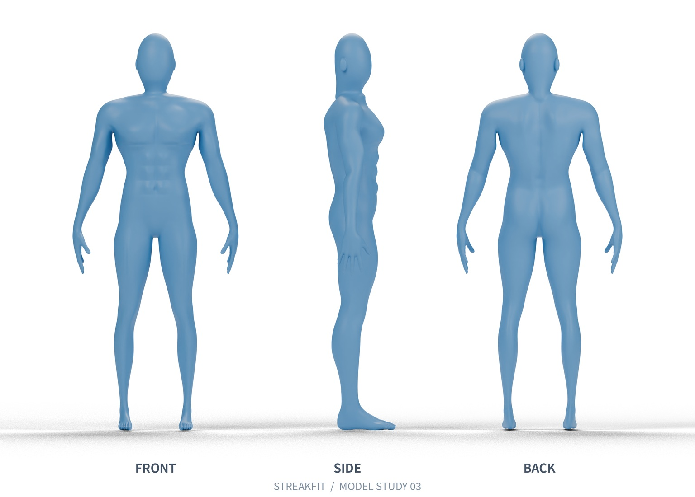

# STREAKFIT 蓝色人体模型 · 静态外观审阅

这里包含正面、侧面、背面效果图，以及可编辑 Blender 模型。
请先确认体型和肌群轮廓，再继续制作教学视频。

## 下载模型

[点击下载完整模型包（约 18 MB）](https://github.com/blueboy-bot/workspace-streakfit/raw/refs/heads/model-review-blue-v3/model-review/blue-v3/STREAKFIT-blue-model-v3-review.zip)

如果浏览器未直接下载：打开 `STREAKFIT-blue-model-v3-review.zip` 文件页面，点击右上角 **Download raw file**（向下箭头）下载。
GitHub 无法直接预览压缩包内容，这是正常的。

下载完成后：

1. 右键 ZIP，选择“全部解压”或“解压缩”。
2. 进入 `STREAKFIT-blue-model-v3` 文件夹。
3. 在 Blender 中选择“文件 → 打开”，打开 `STREAKFIT-blue-model-v3.blend`。

压缩包同时包含效果图、静态预览网页、使用许可与制作记录。
`preview.html` 下载后用浏览器打开即可查看图片。

## 如何在仓库中找到这份模型

1. 打开 `blueboy-bot/workspace-streakfit` 仓库。
2. 点击左上方分支选择框，将 `main` 切换为 **model-review-blue-v3**。
3. 进入 **model-review → blue-v3** 文件夹。
4. 文件列表下方会显示本说明和三视图。

模型是根据图片参考制作的静态重建稿，尚未绑定动画骨架，尚未通过用户外观验收。
