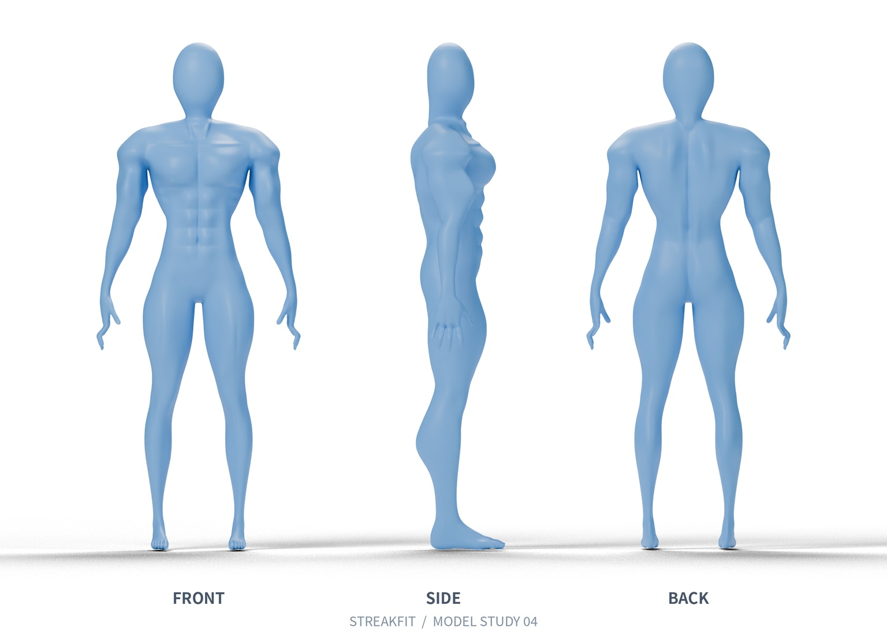

# STREAKFIT 蓝色肌肉模型 v4

按你上传的哑铃弯举录屏重新调整体型，保留蓝色完整表面，不加短裤。本次先审阅外观，尚未制作教学动画。

## 新版三视图

## 下载

- [直接下载 Blender 模型（无需解压）](https://github.com/blueboy-bot/workspace-streakfit/raw/refs/heads/model-review-blue-v4/model-review/blue-v4/STREAKFIT-blue-model-v4.blend)
- [下载完整模型包：Blender 文件、图片及制作说明](https://github.com/blueboy-bot/workspace-streakfit/raw/refs/heads/model-review-blue-v4/model-review/blue-v4/STREAKFIT-blue-model-v4-review.zip)

如果下载链接没有开始保存，打开对应文件页面，点击右上角 **Download raw file（下载箭头）**。ZIP 文件无法在 GitHub 中预览；下载并全部解压后才能查看。

在 Blender 中使用 File → Open 打开 `STREAKFIT-blue-model-v4.blend`，可查看 Front / Side / Back camera。模型本身没有外部贴图依赖。

## 本版调整

- 根据实际录屏重调肩胸、手臂及腿部的肌肉形体和腰部比例。
- 对照手臂放下的参考帧，再调整肩宽相对头部的跨度及上臂体积。
- 增加连续表面的腹肌、锁骨和颈部轮廓，去掉耳部。
- 保留蓝色，无短裤、无外部生殖器模型。

参考提供正面和斜侧面；背面结合此前蓝色三视图。没有原始模型资源，因此这是外观参考重建，尚待你确认，并非原视频模型的逐顶点复原。网格重新打开、连通表面和封闭边缘检查已通过；动画绑定和姿态复核尚未进行。

查看旧版 v3 对照

查找位置：`workspace-streakfit` → 分支 `model-review-blue-v4` → `model-review` → `blue-v4`。
